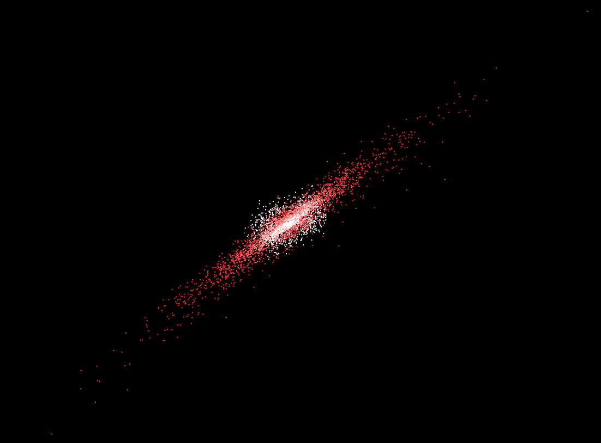
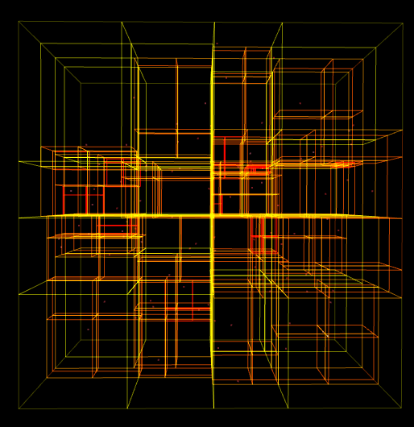
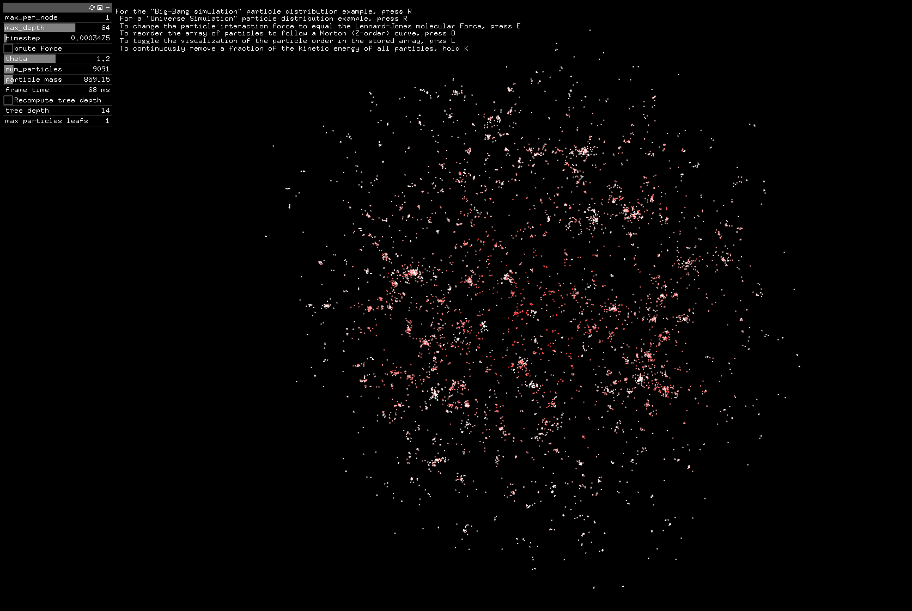
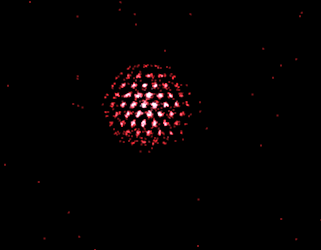
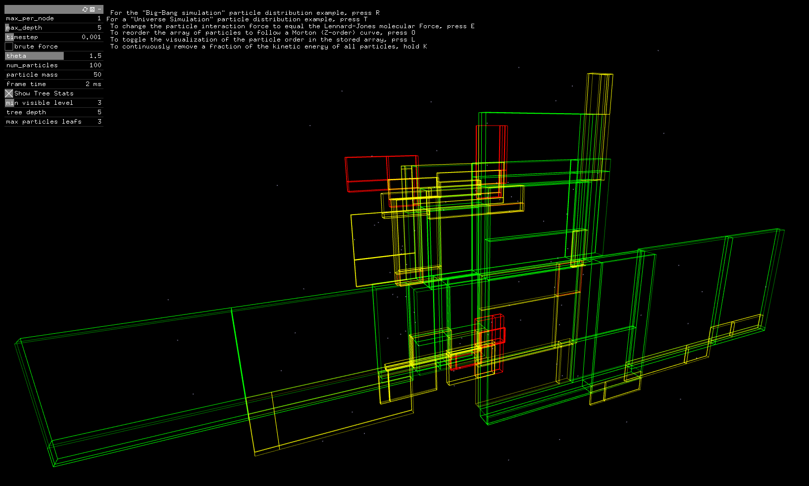

[](https://opensource.org/licenses/MIT)
[](https://gitlab.lrz.de/advprog2022/13/barnes-hut/-/tree/version2)


# Barnes-Hut Simulation

This project is an implementation of the Barnes-Hut algorithm for approximating the gravitational forces between objects in a system. It is commonly used in astrophysical simulations to model the motion of celestial bodies, such as planets and stars. The simulation can be initialized with the positions, masses, and velocities of the objects, and will iteratively update the positions and velocities based on the gravitational forces acting on them.



The basic idea behind the Barnes-Hut algorithm is to divide the system into a grid of cells and to approximate the forces between objects in a cell using the center of mass and total mass of the cell. This allows the simulation to scale to systems with a large number of objects, as the calculation of forces between each object would become computationally infeasible. To improve the accuracy of the simulation, the size of the cells can be decreased, which will result in a more precise calculation of the forces between objects. However, this will also increase the computational cost of the simulation.

This project was made for the Advanced Programming course at the Technical University of Munich.
Authors: Phillip Jurašić & Islam Elgamal
Supervision: Gerasimos Chourdakis

References:
Barnes, J., & Hut, P. (1986). A hierarchical O(N log N) force-calculation algorithm. Nature, 324(6096), 446-449.

# Prerequisites

You need `cmake`, `glm` and `C++ boost` installed for this project to work. `gtest` is used for our unit tests and `openframeworks` for the visualizations. The following commands will install them. The last two lines are for building `gtest` on your machine.

```sh
apt-get install g++-11 cmake 
apt-get install -y libglm-dev libboost-all-dev libgtest-dev 

cd /usr/src/gtest
cmake CMakeLists.txt && make
```

A simple python visualizer is included, which is usable for small simulations <100 particles. Running it requires python3 and the following packages: `plotly`, `numpy`, `pandas`. `Pandas` and `numpy` are used for reading and transforming the data into a format that can be visualized. `Plotly` is used for creating the interactive 3D plot.

# Usage

This project was made with only Linux in mind. There is no guarantee this would work on any other OS.
Please also insure that the latest version of Compiler is installed and set as default.
To execute the project, run the following commands:

```sh
mkdir build && cd build && cmake ..

make barnes-hut
./src/barnes-hut
#to run the 3D live particle visualization:
cd ..
cd visualizer
sudo make
make run

cd ..
pip install -r requirements.txt 
python plot.py
```

1. Creates a folder called `build`, navigates into it, and creates the makefile
2. Compiles and links the project
3. Runs the executable. This produces a .csv file called output.csv as an output of the simulation
4. Installs all the python dependencies for visualizing the results from requirements.txt
5. Runs the python script for visualizing the behavior of the system of particles over a set period of time in 3D space with dynamic POV

# Project: Barnes Hut galaxy Simulation

Idea contributed by Philipp Jurašić and Islam Elgamal

## Motivation

Space is cool, and as admirers of science, we want to know how it works. In this project, we want to play god and create our own galaxy.

We want to approximate the effect of gravity in the formation of gas clouds and the clustering of stars over long periods of time. This will be done by simulating the attractive forces between thousands of particles (representing stars and other celestial bodies).

The [Barnes-Hut algorithm](https://en.m.wikipedia.org/wiki/Barnes%E2%80%93Hut_simulation#/media/File%3A2D_Quad-Tree_partitioning_of_100_bodies.png) is commonly used in computational physics, specifically to approximately compute n-body interactions.



## Sprint 1 (basics)

In this sprint we will implement the n-body problem and a basic Barnes-Hut approximation. The program will randomly generate initial conditions for testing and the result will be outputted for visualization. We will compare the result of the brute force "reference" solution with the Barnes-Hut algorithm.

### Sprint 1: Definition of "done"

- [x] Generate an array of initial masses, positions, and velocities of a system of bodies in 3D space.
- [x] Create a brute force n-body simulation O(n*n) (will be later used as a unit test for verification)
- [x] Create a function for space-dividing an array of coordinates into an octree data structure.
- [x] Implement the Barnes Hut algorithm for simulating the system of bodies over a specified duration of time.
- [x] Create a unit test, that compares the brute force reference solution with the Barnes-Hut approximation for a small test dataset
- [x] Output a time series of the resulting positions of all bodies into a file (e.g. .csv with timestamps) that can be visualized with external tools (e.g. Python script)

## Sprint 2 (OOP)

In this sprint, we will add visualization capabilities to the project, allow the user to configure simulation settings via a config file or command line parameters. The code will be restructured in an Object Oriented way such that the data structure will be based on classes. The functions will be abstracted with interfaces such that they can be switched to any arbitrary interaction function.

### Sprint 2: Definition of "done"

- [x] Add the ability to specify parameters like the initial conditions, timestep size, simulation duration, etc. in either a configuration file or as command line parameters.
- [x] Implement appropriate access control modifiers for functions and variables.
- [x] Apply appropriate usage of references and pointers for optimal memory allocation.
- [x] Add the ability to visualize the dynamics of the simulation in 3D space.
- [x] Abstract the interaction function of the bodies (and add an example of how to use it, e.g. gravity potential and Lennard Jones potential)
- [x] Abstract the space-dividing function
- [x] Clean up and refactor the code
- [x] Create a Second Order Integrator for the Barnes-Hut Simulation
- [x] Create an Interactive GUI for the Simulation
- [x] Support Different Initial Conditions



Molecular dynamics simulation using the newly added Lennard Jones potential. By gradually removing energy from the system, the particles start forming hexagonal crystaline structures.



## Sprint 3 (performance and/or STL)

In this sprint, we will analyze and optimize the performance and computation time of the program. The focus will be to study how much impact each section of the code has on the total runtime and the effect of each optimization step taken to reduce computation time.

### Sprint 3: Definition of "done"

- [x] Measure how much time is consumed during each section in the code (single and multithreaded profiles at the bottom of the README)
- [x] Utilize at least three different optimization techniques and study their impact on total runtime
- [x] At least one function should utilize vectorized instructions
- Try Feedback-Directed Compiler Optimization (FDO) in g++ using the -fprofile-generate and -fprofile-use flags (8% improvement with large particle systems >5k). (*Optional*:  Compare to performance using -fauto-profile and Linux perf)

- [x] Switched from shared_ptr to unique_ptr implementation for the tree (Improved tree build times by slightly)
- [x] Only leaf nodes store a vector of pointers, reducing the number of stored particle pointers from Nlog(N) to N
- [x] Sorting the particle array before the simulation to improve cache coherence (In single-threaded benchmark UNIVERSE4 with 30k particles, 10s and 0.1s timestep the execution time was reduced from 1m13.605 to 55.010s. **That is a 30% improvement in execution time**) (Confirmed using Valgrind Cache reports)

- [x] Checking if the distance is zero in the force computation is more expensive than just computing and subtracting the softened force (always compute and subtract: 50k 52s 9.9s vs check if the distance is zero: 50k 54s 10.5s) 5k: 6.8s 6.9s vs 6.7s 6.6s
- [x] Is passing the position vector by value faster than by reference in the computeAcceleration function? No. (17.3s by value, 10.0s by reference)
- [x] Also compare if by value and by reference make a difference in Tree.cpp selectOctant() and less_than_theta(). No measurable difference. (10s by value, 10s by reference)
- [x] OpenMP parallel for loop for multithreading the simulation.
- [x] Brute force optimizations:
  - Single-threaded, vectorized: 9.57s
  - Single-threaded, vectorized, subtraction instead of position comparison: 9.91s
  - Multi-threaded, vectorized, parallel inner loop: 36.86s (16cores)
  - Multi-threaded, vectorized, parallel outer loop: 1.13s  (16cores)
- [x] OpenMP for explicit SIMD for vectorization. (All our attempts resulted in longer runtimes than. GLM already uses some SIMD instructions for the vector math)
- [ ] OpenMP parallel for loop for multithreading the tree construction.

  ```
  Single-threaded gperf analysis:
  Flat profile:

  Each sample counts as 0.01 seconds.
    %   cumulative   self              self     total           
  time   seconds   seconds    calls   s/call   s/call  name    
  98.38      4.26     4.26   120000     0.00     0.00  Tree::computeAccFromPos(glm::vec<3, double, (glm::qualifier)0> const&, double) const
    0.46      4.28     0.02   120000     0.00     0.00  Tree::insert(std::unique_ptr<Particle, std::default_delete<Particle> >)
    0.46      4.30     0.02                             _init
    0.23      4.31     0.01       96     0.00     0.00  std::vector<Tree, std::allocator<Tree> >::~vector()
    ```

  ```
  Multi-threaded gperf analysis with 16 cores:
  Flat profile:

  Each sample counts as 0.01 seconds.
    %   cumulative   self              self     total           
  time   seconds   seconds    calls   s/call   s/call  name    
  71.08      1.18     1.18     6786     0.00     0.00  Tree::computeAccFromPos(glm::vec<3, double, (glm::qualifier)0> const&, double) const
  16.27      1.45     0.27   266225     0.00     0.00  Tree::insert(std::unique_ptr<Particle, std::default_delete<Particle> >)
    7.23      1.57     0.12       17     0.01     0.01  Tree::computeCOM()
    3.61      1.63     0.06      387     0.00     0.00  std::vector<Tree, std::allocator<Tree> >::~vector()
    1.81      1.66     0.03   135658     0.00     0.00  Tree::createBranches()

  ```

  While tree construction is fast, taking up ~1% of the runtime in the single threaded example using 10k particles and theta=1.5, the construction overhead becomes more and more noticable when using more cores. The tree construction is entirely single threaded, the force calculation is almost trivially parallel.

## Gallery



